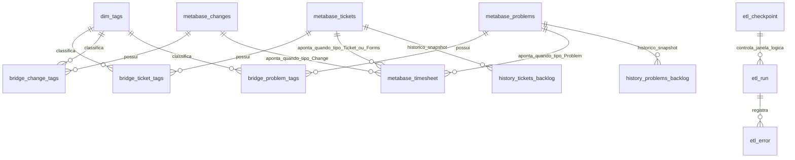

# Documentação Completa do Banco de Dados DW / Metabase

Este documento consolida a documentação funcional e técnica das tabelas mantidas pelo ETL GLPI → DW usadas no Metabase.

## 1. Escopo

Este documento cobre as tabelas gerenciadas pelo projeto no banco do Data Warehouse:

- `metabase_tickets`
- `metabase_changes`
- `metabase_problems`
- `metabase_timesheet`
- `dim_tags`
- `bridge_ticket_tags`
- `bridge_change_tags`
- `bridge_problem_tags`
- `history_tickets_backlog`
- `history_problems_backlog`
- `etl_checkpoint`
- `etl_run`
- `etl_error`

> Observação: consultas analíticas também referenciam `dim_calendario`, mas essa dimensão não é criada nem abastecida por este projeto.

## 2. Convenções Gerais do DW

- **Timezone:** todo o ETL opera em **UTC**.
- **Carga idempotente:** as cargas usam `INSERT ... ON DUPLICATE KEY UPDATE`.
- **Recarga full:** em `tickets`, `changes` e `problems`, registros ausentes na origem podem ser removidos do DW ao final da carga full por comparação de `data_carga`.
- **Relacionamentos:** o modelo usa **relacionamentos lógicos**, sem `FOREIGN KEY` física nas tabelas.
- **Tags:** cada entidade mantém:
  - uma coluna textual agregada (`tags`) para consumo simples no Metabase;
  - uma modelagem normalizada via `dim_tags` + tabelas bridge para filtros e cruzamentos.

## 3. Visão Geral de Relacionamentos

## 4. Matriz Resumida das Tabelas

| Tabela | Papel | Grão | Origem principal |
|---|---|---|---|
| `metabase_tickets` | Fato principal de incidentes e requisições | 1 linha por ticket GLPI | `glpi_tickets` + dimensões auxiliares do GLPI |
| `metabase_changes` | Fato principal de mudanças | 1 linha por change GLPI | `glpi_changes` + plugin Fields + tags |
| `metabase_problems` | Fato principal de problemas | 1 linha por problem GLPI | `glpi_problems` + plugin Fields + tags |
| `metabase_timesheet` | Fato consolidado de horas | 1 linha por tarefa ou resposta do Form 142 | `glpi_*tasks` + `Formcreator` |
| `dim_tags` | Dimensão de etiquetas | 1 linha por tag GLPI | `glpi_plugin_tag_tags` |
| `bridge_ticket_tags` | Ponte N:N entre tickets e tags | 1 linha por par ticket/tag | `glpi_plugin_tag_tagitems` |
| `bridge_change_tags` | Ponte N:N entre mudanças e tags | 1 linha por par change/tag | `glpi_plugin_tag_tagitems` |
| `bridge_problem_tags` | Ponte N:N entre problemas e tags | 1 linha por par problem/tag | `glpi_plugin_tag_tagitems` |
| `history_tickets_backlog` | Histórico diário de backlog de tickets | 1 linha por ticket aberto por dia de coleta | `metabase_tickets` |
| `history_problems_backlog` | Histórico diário de backlog de problemas | 1 linha por problema aberto por dia de coleta | `metabase_problems` |
| `etl_checkpoint` | Controle de última carga bem-sucedida | 1 linha por entidade ETL | próprio ETL |
| `etl_run` | Log de execução das cargas | 1 linha por execução | próprio ETL |
| `etl_error` | Log de erros | 1 linha por erro | próprio ETL |

---

# 5. Documentação por Tabela

## 5.1 `metabase_tickets`

### Finalidade
Tabela fato principal para análise de **Incidentes** e **Requisições** extraídos do GLPI.

### Grão
Uma linha por chamado em `glpi_tickets.id`.

### Chave
- **PK:** `chamado`

### Relacionamentos lógicos
- `metabase_tickets.chamado` 1:N `bridge_ticket_tags.ticket_id`
- `bridge_ticket_tags.tag_id` N:1 `dim_tags.tag_id`
- `metabase_tickets.chamado` 1:N `metabase_timesheet.id_pai` quando `tipo_ticket = 'Ticket'`
- `metabase_tickets.chamado` 1:N `metabase_timesheet.id_pai` quando `tipo_ticket = 'Forms'` (horas originadas do Formulário 142, vinculadas ao ticket pai)

### Origem dos dados
Principalmente:
- `glpi_tickets`
- `glpi_itilcategories`
- `glpi_entities`
- `glpi_locations`
- `glpi_users`
- `glpi_requesttypes`
- `glpi_itilsolutions`
- `glpi_solutiontypes`
- `glpi_groups_tickets`
- `glpi_groups`
- `glpi_tickets_users`
- `glpi_tickettasks`
- `glpi_plugin_tag_tagitems`
- `glpi_plugin_tag_tags`

### Regras de negócio aplicadas
- Apenas tickets com `is_deleted = 0` são carregados.
- `tipo_chamado`:
  - `1 = Incidente`
  - `2 = Requisição`
  - demais = `Outro`
- `status_chamado` é traduzido do código numérico do GLPI para descrição textual.
- Cálculos de SLA (`status_sla`, `tto_status`, `ttr_status`, flags de risco e conformidade) são feitos no SQL do extractor.
- `dias_sem_atualizacao` é calculado como diferença entre `date_mod` e `UTC_TIMESTAMP()`.
- `faixa_sem_atualizacao` e `faixa_aging` são derivadas no transformer:
  - sem atualização: `Até 1 dia`, `Até 3 dias`, `Até 7 dias`, `Maior que 7 dias`
  - aging: `0 a 3 dias`, `Até 5 dias`, `Até 10 dias`, `Até 15 dias`, `Até 30 dias`, `Maior que 30 dias`
- Para tickets fechados/solucionados, as faixas são preenchidas como `N/A`.
- `categoria`, `subcategoria` e `servico` são decompostos a partir de `glpi_itilcategories.completename`.
- `tipo_contrato`, `grupo_solucao` e `tipo_atividade` são decompostos a partir de `glpi_groups.completename` do grupo solucionador.
- `tempo_total_lancados` é a soma do `actiontime` das tarefas do ticket convertida para horas.
- `tem_tecnico_atribuido` indica existência de usuário atribuído do tipo técnico.
- `tem_prioridade` indica prioridade diferente de zero.
- `reaberturas` e `incidente_recorrente` atualmente são carregados fixos como `0`.
- A coluna `tags` contém agregação textual das tags ativas do ticket.
- Em carga `full`, tickets não recarregados na execução podem ser removidos via `data_carga`.

### Índices
- `PRIMARY KEY (chamado)`
- `idx_data_id (data_id)`
- `idx_status (status_chamado)`
- `idx_entidade (entidade_cliente)`

### Dicionário de colunas

| Coluna | Tipo | Origem | Regra / significado |
|---|---|---|---|
| `chamado` | `INT` | `glpi_tickets.id` | Identificador do ticket no GLPI |
| `titulo_chamado` | `VARCHAR(255)` | `glpi_tickets.name` | Título do chamado |
| `tipo_chamado` | `VARCHAR(50)` | `glpi_tickets.type` | Mapeado para Incidente, Requisição ou Outro |
| `data_criacao` | `DATETIME` | `glpi_tickets.date` | Data de abertura |
| `data_solucao` | `DATETIME` | `glpi_tickets.solvedate` | Data de solução |
| `data_fechamento` | `DATETIME` | `glpi_tickets.closedate` | Data de fechamento |
| `data_ultima_atualizacao` | `DATETIME` | `glpi_tickets.date_mod` | Última atualização do ticket |
| `data_id` | `DATE` | `DATE(glpi_tickets.date)` | Chave de data analítica |
| `status_chamado` | `VARCHAR(50)` | `glpi_tickets.status` | Status traduzido para texto |
| `prioridade` | `VARCHAR(20)` | `glpi_tickets.priority` | Valor convertido para texto |
| `urgencia` | `VARCHAR(20)` | `glpi_tickets.urgency` | Valor convertido para texto |
| `impacto` | `VARCHAR(20)` | `glpi_tickets.impact` | Valor convertido para texto |
| `canal` | `VARCHAR(100)` | `glpi_requesttypes.name` | Canal de abertura |
| `status_sla` | `VARCHAR(50)` | cálculo SQL | Situação consolidada do SLA |
| `tto_status` | `VARCHAR(50)` | cálculo SQL | Situação do SLA de atendimento |
| `ttr_status` | `VARCHAR(50)` | cálculo SQL | Situação do SLA de solução |
| `tto_em_risco` | `TINYINT(1)` | cálculo SQL | 1 quando atendimento está em risco |
| `ttr_em_risco` | `TINYINT(1)` | cálculo SQL | 1 quando solução está em risco |
| `limite_solucao` | `DATETIME` | `glpi_tickets.time_to_resolve` | Deadline de solução |
| `limite_atendimento` | `DATETIME` | `glpi_tickets.time_to_own` | Deadline de atendimento |
| `sla_risco` | `TINYINT(1)` | cálculo SQL | 1 quando SLA geral está em risco |
| `sla_atendimento_ok` | `TINYINT(1)` | cálculo SQL | 1 se atendimento ocorreu no prazo |
| `sla_solucao_ok` | `TINYINT(1)` | cálculo SQL | 1 se solução ocorreu no prazo |
| `tma_minutos` | `INT` | cálculo SQL | Tempo até primeiro atendimento |
| `mttr_minutos` | `INT` | cálculo SQL | Tempo até solução |
| `aging_minutos` | `INT` | cálculo SQL | Tempo de vida do ticket em minutos |
| `tempo_primeiro_atendimento_minutos` | `INT` | cálculo SQL | Equivale ao TMA |
| `tempo_espera_minutos` | `INT` | `glpi_tickets.sla_waiting_duration` | Tempo em espera convertido de segundos para minutos |
| `dias_sem_atualizacao` | `INT` | cálculo SQL | Dias desde a última atualização |
| `faixa_sem_atualizacao` | `VARCHAR(50)` | transformer | Faixa categórica de dias sem atualização |
| `faixa_aging` | `VARCHAR(50)` | transformer | Faixa categórica de aging |
| `servico_completo` | `VARCHAR(255)` | `glpi_itilcategories.completename` | Caminho completo da categoria |
| `categoria` | `VARCHAR(100)` | derivado de `servico_completo` | Primeiro nível da categoria |
| `subcategoria` | `VARCHAR(100)` | derivado de `servico_completo` | Segundo nível da categoria |
| `servico` | `VARCHAR(100)` | derivado de `servico_completo` | Último nível da categoria |
| `tipo_solucao` | `VARCHAR(255)` | `glpi_solutiontypes.name` | Tipo/modelo de solução |
| `disciplina_solucao` | `VARCHAR(100)` | derivado de `tipo_solucao` | Parte anterior a `::` |
| `modelo_solucao` | `VARCHAR(100)` | derivado de `tipo_solucao` | Parte posterior a `::` ou o valor inteiro |
| `grupo_solucionador` | `VARCHAR(255)` | `glpi_groups.completename` | Grupo completo responsável |
| `grupo_solucionador_nome` | `VARCHAR(255)` | `glpi_groups.name` | Nome simples do grupo |
| `id_grupo_solucionador` | `INT` | `glpi_groups.id` | ID do grupo solucionador |
| `tipo_contrato` | `VARCHAR(100)` | derivado de `grupo_solucionador` | Primeiro nível da hierarquia do grupo |
| `grupo_solucao` | `VARCHAR(100)` | derivado de `grupo_solucionador` | Segundo nível da hierarquia do grupo |
| `tipo_atividade` | `VARCHAR(100)` | derivado de `grupo_solucionador` | Último nível da hierarquia do grupo |
| `agente_solucionador` | `VARCHAR(255)` | `glpi_users` | Nome do técnico atribuído |
| `nome_solicitante` | `VARCHAR(255)` | `glpi_users` | Nome do solicitante |
| `nome_tecnico_responsavel` | `VARCHAR(255)` | `glpi_users` | Mesmo técnico atribuído usado em `agente_solucionador` |
| `entidade_cliente` | `VARCHAR(255)` | `glpi_entities.name` | Cliente / entidade |
| `localizacao_fisica` | `VARCHAR(255)` | `glpi_locations.name` | Localização física |
| `reaberturas` | `INT` | valor fixo | Atualmente sempre `0` |
| `tempo_total_lancados` | `DECIMAL(10,2)` | soma de `glpi_tickettasks.actiontime` | Total apontado em horas |
| `tem_tecnico_atribuido` | `TINYINT(1)` | cálculo SQL | 1 se existe técnico atribuído |
| `tem_prioridade` | `TINYINT(1)` | cálculo SQL | 1 se prioridade foi definida |
| `incidente_recorrente` | `TINYINT(1)` | valor fixo | Atualmente sempre `0` |
| `tags` | `TEXT` | agregação de `glpi_plugin_tag_tags.name` | Lista textual de tags ativas |
| `users_id_recipient` | `INT` | `glpi_tickets.users_id_recipient` | ID do solicitante |
| `locations_id` | `INT` | `glpi_tickets.locations_id` | ID da localização |
| `data_carga` | `DATETIME` | ETL | Timestamp UTC da execução que gravou a linha |

---

## 5.2 `metabase_changes`

### Finalidade
Tabela fato principal para análise de **Mudanças** do GLPI.

### Grão
Uma linha por registro de `glpi_changes.id`.

### Chave
- **PK:** `chamado`

### Relacionamentos lógicos
- `metabase_changes.chamado` 1:N `bridge_change_tags.change_id`
- `bridge_change_tags.tag_id` N:1 `dim_tags.tag_id`
- `metabase_changes.chamado` 1:N `metabase_timesheet.id_pai` quando `tipo_ticket = 'Change'`

### Origem dos dados
Principalmente:
- `glpi_changes`
- `glpi_itilcategories`
- `glpi_entities`
- `glpi_locations`
- `glpi_users`
- `glpi_plugin_fields_changegestodemudanas`
- `glpi_plugin_fields_classificaofielddropdowns`
- `glpi_plugin_fields_classificaotecnicafielddropdowns`
- `glpi_plugin_fields_ambientefielddropdowns`
- `glpi_itilsolutions`
- `glpi_solutiontypes`
- `glpi_changes_groups`
- `glpi_groups`
- `glpi_changes_users`
- `glpi_plugin_tag_tagitems`
- `glpi_plugin_tag_tags`

### Regras de negócio aplicadas
- Apenas mudanças com `is_deleted = 0` são carregadas.
- `status_chamado` é traduzido do código numérico do GLPI.
- `data_fechamento` usa `COALESCE(closedate, solvedate, date)` para sempre fornecer uma referência de fechamento.
- `ttr_status`, `ttr_em_risco` e `limite_solucao` são calculados em SQL.
- `mttr_minutos` é o tempo entre abertura e solução.
- `aging_minutos` usa a solução quando existente; caso contrário usa o momento atual em UTC.
- `categoria`, `subcategoria`, `servico` e hierarquia do grupo são derivados dos campos `completename`.
- Campos de gestão de mudança vêm do plugin Fields:
  - `classificacao`
  - `classificacao_tecnica`
  - `ambiente`
  - `data_inicio_mudanca`
  - `data_fim_mudanca`
  - `justificativa`
  - `impacto_negocio`
- A coluna `tags` armazena agregação textual das tags ativas.
- Em carga `full`, mudanças não recarregadas podem ser removidas do DW via `data_carga`.

### Dicionário de colunas

| Coluna | Tipo | Origem | Regra / significado |
|---|---|---|---|
| `chamado` | `INT` | `glpi_changes.id` | Identificador da mudança |
| `titulo_chamado` | `VARCHAR(255)` | `glpi_changes.name` | Título |
| `data_criacao` | `DATETIME` | `glpi_changes.date` | Abertura |
| `data_solucao` | `DATETIME` | `glpi_changes.solvedate` | Solução |
| `data_fechamento` | `DATETIME` | `COALESCE(closedate, solvedate, date)` | Fechamento analítico |
| `data_ultima_atualizacao` | `DATETIME` | `glpi_changes.date_mod` | Última atualização |
| `data_id` | `DATE` | `DATE(glpi_changes.date)` | Chave de data |
| `status_chamado` | `VARCHAR(50)` | `glpi_changes.status` | Status textual |
| `prioridade` | `VARCHAR(20)` | `glpi_changes.priority` | Valor convertido para texto |
| `urgencia` | `VARCHAR(20)` | `glpi_changes.urgency` | Valor convertido para texto |
| `impacto` | `VARCHAR(20)` | `glpi_changes.impact` | Valor convertido para texto |
| `ttr_status` | `VARCHAR(50)` | cálculo SQL | Situação do SLA de solução |
| `ttr_em_risco` | `TINYINT(1)` | cálculo SQL | Flag de risco do SLA |
| `limite_solucao` | `DATETIME` | `glpi_changes.time_to_resolve` | Deadline de solução |
| `mttr_minutos` | `INT` | cálculo SQL | Tempo até solução |
| `aging_minutos` | `INT` | cálculo SQL | Tempo de vida da mudança |
| `servico_completo` | `VARCHAR(255)` | `glpi_itilcategories.completename` | Categoria completa |
| `categoria` | `VARCHAR(100)` | derivado | Primeiro nível |
| `subcategoria` | `VARCHAR(100)` | derivado | Segundo nível |
| `servico` | `VARCHAR(100)` | derivado | Último nível |
| `tipo_solucao` | `VARCHAR(255)` | `glpi_solutiontypes.name` | Tipo/modelo de solução |
| `disciplina_solucao` | `VARCHAR(100)` | derivado de `tipo_solucao` | Parte anterior a `::` |
| `modelo_solucao` | `VARCHAR(100)` | derivado de `tipo_solucao` | Parte posterior a `::` ou valor inteiro |
| `grupo_solucionador` | `VARCHAR(255)` | `glpi_groups.completename` | Grupo responsável completo |
| `grupo_solucionador_nome` | `VARCHAR(255)` | `glpi_groups.name` | Nome simples |
| `id_grupo_solucionador` | `INT` | `glpi_groups.id` | ID do grupo |
| `tipo_contrato` | `VARCHAR(100)` | derivado de `grupo_solucionador` | Primeiro nível do grupo |
| `grupo_solucao` | `VARCHAR(100)` | derivado de `grupo_solucionador` | Segundo nível do grupo |
| `tipo_atividade` | `VARCHAR(100)` | derivado de `grupo_solucionador` | Último nível do grupo |
| `classificacao` | `VARCHAR(255)` | plugin Fields | Classificação da mudança |
| `classificacao_tecnica` | `VARCHAR(255)` | plugin Fields | Classificação técnica |
| `ambiente` | `VARCHAR(255)` | plugin Fields | Ambiente afetado |
| `data_inicio_mudanca` | `DATETIME` | plugin Fields | Início planejado/registrado |
| `data_fim_mudanca` | `DATETIME` | plugin Fields | Fim planejado/registrado |
| `justificativa` | `TEXT` | plugin Fields | Justificativa da mudança |
| `impacto_negocio` | `TEXT` | plugin Fields | Impacto no negócio |
| `agente_solucionador` | `VARCHAR(255)` | `glpi_users` | Técnico atribuído |
| `nome_solicitante` | `VARCHAR(255)` | `glpi_users` | Solicitante |
| `entidade_cliente` | `VARCHAR(255)` | `glpi_entities.name` | Cliente / entidade |
| `localizacao_fisica` | `VARCHAR(255)` | `glpi_locations.name` | Localização |
| `tags` | `TEXT` | agregação de tags | Lista textual de tags ativas |
| `users_id_recipient` | `INT` | `glpi_changes.users_id_recipient` | ID do solicitante |
| `locations_id` | `INT` | `glpi_changes.locations_id` | ID da localização |
| `data_carga` | `DATETIME` | ETL | Timestamp UTC da carga |

---

## 5.3 `metabase_problems`

### Finalidade
Tabela fato principal para análise de **Problemas** do GLPI.

### Grão
Uma linha por registro de `glpi_problems.id`.

### Chave
- **PK:** `chamado`

### Relacionamentos lógicos
- `metabase_problems.chamado` 1:N `bridge_problem_tags.problem_id`
- `bridge_problem_tags.tag_id` N:1 `dim_tags.tag_id`
- `metabase_problems.chamado` 1:N `metabase_timesheet.id_pai` quando `tipo_ticket = 'Problem'`

### Origem dos dados
Principalmente:
- `glpi_problems`
- `glpi_itilcategories`
- `glpi_entities`
- `glpi_locations`
- `glpi_users`
- `glpi_plugin_fields_problemgestaoproblemas`
- `glpi_plugin_fields_causaraizfielddropdowns`
- `glpi_itilsolutions`
- `glpi_solutiontypes`
- `glpi_groups_problems`
- `glpi_groups`
- `glpi_problems_users`
- `glpi_plugin_tag_tagitems`
- `glpi_plugin_tag_tags`

### Regras de negócio aplicadas
- Apenas problemas com `is_deleted = 0` são carregados.
- `status_chamado` é traduzido do código numérico do GLPI.
- `ttr_status`, `ttr_em_risco` e `limite_solucao` são calculados no extractor.
- `mttr_minutos` e `aging_minutos` são derivados da diferença entre abertura e solução/instante atual.
- `categoria`, `subcategoria`, `servico` e hierarquia do grupo são derivados de campos `completename`.
- `causa_raiz` vem do plugin Fields de gestão de problemas.
- A coluna `tags` armazena a lista textual das tags ativas do problema.
- Em carga `full`, problemas ausentes na recarga podem ser removidos via `data_carga`.

### Dicionário de colunas

| Coluna | Tipo | Origem | Regra / significado |
|---|---|---|---|
| `chamado` | `INT` | `glpi_problems.id` | Identificador do problema |
| `titulo_chamado` | `VARCHAR(255)` | `glpi_problems.name` | Título |
| `data_criacao` | `DATETIME` | `glpi_problems.date` | Abertura |
| `data_solucao` | `DATETIME` | `glpi_problems.solvedate` | Solução |
| `data_fechamento` | `DATETIME` | `glpi_problems.closedate` | Fechamento |
| `data_ultima_atualizacao` | `DATETIME` | `glpi_problems.date_mod` | Última atualização |
| `data_id` | `DATE` | `DATE(glpi_problems.date)` | Chave de data |
| `status_chamado` | `VARCHAR(50)` | `glpi_problems.status` | Status textual |
| `prioridade` | `VARCHAR(20)` | `glpi_problems.priority` | Valor convertido para texto |
| `urgencia` | `VARCHAR(20)` | `glpi_problems.urgency` | Valor convertido para texto |
| `impacto` | `VARCHAR(20)` | `glpi_problems.impact` | Valor convertido para texto |
| `ttr_status` | `VARCHAR(50)` | cálculo SQL | Situação do SLA de solução |
| `ttr_em_risco` | `TINYINT(1)` | cálculo SQL | Flag de risco |
| `limite_solucao` | `DATETIME` | `glpi_problems.time_to_resolve` | Deadline de solução |
| `mttr_minutos` | `INT` | cálculo SQL | Tempo até solução |
| `aging_minutos` | `INT` | cálculo SQL | Tempo de vida do problema |
| `servico_completo` | `VARCHAR(255)` | `glpi_itilcategories.completename` | Categoria completa |
| `categoria` | `VARCHAR(100)` | derivado | Primeiro nível |
| `subcategoria` | `VARCHAR(100)` | derivado | Segundo nível |
| `servico` | `VARCHAR(100)` | derivado | Último nível |
| `tipo_solucao` | `VARCHAR(255)` | `glpi_solutiontypes.name` | Tipo/modelo de solução |
| `disciplina_solucao` | `VARCHAR(100)` | derivado | Parte anterior a `::` |
| `modelo_solucao` | `VARCHAR(100)` | derivado | Parte posterior a `::` ou valor inteiro |
| `grupo_solucionador` | `VARCHAR(255)` | `glpi_groups.completename` | Grupo responsável |
| `grupo_solucionador_nome` | `VARCHAR(255)` | `glpi_groups.name` | Nome simples |
| `id_grupo_solucionador` | `INT` | `glpi_groups.id` | ID do grupo |
| `tipo_contrato` | `VARCHAR(100)` | derivado | Primeiro nível do grupo |
| `grupo_solucao` | `VARCHAR(100)` | derivado | Segundo nível do grupo |
| `tipo_atividade` | `VARCHAR(100)` | derivado | Último nível do grupo |
| `causa_raiz` | `VARCHAR(255)` | plugin Fields | Causa raiz do problema |
| `agente_solucionador` | `VARCHAR(255)` | `glpi_users` | Técnico atribuído |
| `nome_solicitante` | `VARCHAR(255)` | `glpi_users` | Solicitante |
| `entidade_cliente` | `VARCHAR(255)` | `glpi_entities.name` | Cliente / entidade |
| `localizacao_fisica` | `VARCHAR(255)` | `glpi_locations.name` | Localização |
| `tags` | `TEXT` | agregação de tags | Lista textual de tags ativas |
| `users_id_recipient` | `INT` | `glpi_problems.users_id_recipient` | ID do solicitante |
| `locations_id` | `INT` | `glpi_problems.locations_id` | ID da localização |
| `data_carga` | `DATETIME` | ETL | Timestamp UTC da carga |

---

## 5.4 `metabase_timesheet`

### Finalidade
Tabela fato consolidada de **apontamentos de horas** para tickets, mudanças, problemas e Formulário 142 do Formcreator.

### Grão
Uma linha por:
- tarefa de ticket (`glpi_tickettasks`)
- tarefa de mudança (`glpi_changetasks`)
- tarefa de problema (`glpi_problemtasks`)
- resposta do **Formulário 142** (`glpi_plugin_formcreator_formanswers`)

### Chave
- **PK:** `id_tarefa`

### Relacionamentos lógicos
- `metabase_timesheet.id_pai` → `metabase_tickets.chamado` quando `tipo_ticket = 'Ticket'`
- `metabase_timesheet.id_pai` → `metabase_changes.chamado` quando `tipo_ticket = 'Change'`
- `metabase_timesheet.id_pai` → `metabase_problems.chamado` quando `tipo_ticket = 'Problem'`
- `metabase_timesheet.id_pai` → `metabase_tickets.chamado` quando `tipo_ticket = 'Forms'` (resposta de Form 142 ligada a ticket pai)

### Origem dos dados
#### Tarefas padrão
- `glpi_tickettasks`
- `glpi_changetasks`
- `glpi_problemtasks`
- tabelas pai: `glpi_tickets`, `glpi_changes`, `glpi_problems`
- `glpi_entities`
- `glpi_users`
- `glpi_taskcategories`
- grupos solucionadores (`glpi_groups_tickets`, `glpi_changes_groups`, `glpi_groups_problems`, `glpi_groups`)

#### Formulário 142
- `glpi_plugin_formcreator_formanswers`
- `glpi_plugin_formcreator_answers`
- `glpi_plugin_formcreator_questions`
- `glpi_items_tickets`
- `glpi_tickets`
- `glpi_users`
- `glpi_entities`
- `glpi_groups`
- `glpi_tickettasks` (para somatório de horas do ticket vinculado)

### Regras de negócio aplicadas
- Consolida tarefas de `Ticket`, `Change`, `Problem` e `Forms` em uma única tabela.
- Registros com `actiontime <= 0` são ignorados.
- O extrator usa `JOIN` com a entidade pai, o que elimina registros órfãos sem vínculo válido.
- Para tarefas de ticket, se o ticket estiver vinculado ao **Formulário 142**, as tarefas de `glpi_tickettasks` desse ticket são **ignoradas** para evitar dupla contagem.
- As horas do **Formulário 142** são carregadas separadamente como `tipo_ticket = 'Forms'`.
- No Form 142:
  - `cliente` vem da pergunta `1653`
  - `grupo_solucionador` vem da pergunta `1654`
  - `data_lancamento` vem da pergunta `1651`
  - `tipo_hora` vem da pergunta `1655`
- No Form 142, `horas` é calculada como a soma de `glpi_tickettasks.actiontime` do ticket pai convertida para horas.
- Registros de Form 142 com total de horas igual a zero são descartados via `HAVING horas > 0`.
- A carga usa upsert por `id_tarefa`.
- A implementação atual faz limpeza específica de duplicidade em cenário full para tickets ligados ao Form 142, mas não possui pruning genérico por `data_carga` como as tabelas de tickets/mudanças/problemas.

### Estrutura final da tabela
> A estrutura final resulta de `sql/ddl.sql` + `alter_timesheet.sql` + `alter_timesheet_v2.sql` + `alter_timesheet_v3_add_id_resposta.sql`.

### Índices
- `PRIMARY KEY (id_tarefa)`
- `idx_data_lancamento (data_lancamento)`
- `idx_tecnico (tecnico)`
- `idx_cliente (cliente)`
- `idx_timesheet_id_original (id_tarefa_original)`
- `idx_timesheet_id_formatado (id_tarefa_formatado)`
- `idx_timesheet_data_criacao (data_criacao_tarefa)`

### Dicionário de colunas

| Coluna | Tipo | Origem | Regra / significado |
|---|---|---|---|
| `id_tarefa` | `VARCHAR(100)` | ETL | Chave técnica. Ex.: `Ticket_123`, `Change_45`, `Problem_9`, `FORM_77` |
| `id_tarefa_original` | `INT` | origem operacional | ID original da tarefa ou da resposta do formulário |
| `id_resposta` | `INT` | Formcreator | Preenchido apenas para registros do Form 142 |
| `id_tarefa_formatado` | `VARCHAR(50)` | ETL | Identificador amigável no padrão `id_pai-id_original` |
| `tipo_ticket` | `VARCHAR(20)` | ETL | `Ticket`, `Change`, `Problem` ou `Forms` |
| `id_pai` | `INT` | tabela pai | ID do ticket/change/problem associado |
| `data_abertura_pai` | `DATETIME` | tabela pai | Data de abertura do registro pai |
| `data_fechamento_pai` | `DATETIME` | tabela pai | Data de fechamento do registro pai |
| `cliente` | `VARCHAR(255)` | entidade do pai ou resposta do formulário | Cliente / entidade |
| `grupo_solucionador` | `VARCHAR(255)` | grupo do pai ou resposta do formulário | Torre / grupo |
| `tecnico` | `VARCHAR(255)` | `glpi_users` | Técnico responsável pelo apontamento |
| `data_lancamento` | `DATETIME` | tarefa ou formulário | Data do lançamento |
| `data_criacao_tarefa` | `DATETIME` | tarefa ou `request_date` do formulário | Data original de criação do item de horas |
| `horas` | `DECIMAL(10,4)` | cálculo | `actiontime / 3600` ou soma das tarefas do ticket no Form 142 |
| `tipo_hora` | `VARCHAR(50)` | `glpi_taskcategories.name` ou pergunta 1655 | Tipo de hora, com fallback `Comercial` nas tarefas padrão |
| `data_carga` | `DATETIME` | ETL | Timestamp UTC da carga |

---

## 5.5 `dim_tags`

### Finalidade
Dimensão de etiquetas do plugin de tags do GLPI.

### Grão
Uma linha por tag em `glpi_plugin_tag_tags.id`.

### Chave
- **PK:** `tag_id`

### Relacionamentos lógicos
- `dim_tags.tag_id` 1:N `bridge_ticket_tags.tag_id`
- `dim_tags.tag_id` 1:N `bridge_change_tags.tag_id`
- `dim_tags.tag_id` 1:N `bridge_problem_tags.tag_id`

### Origem dos dados
- `glpi_plugin_tag_tags`

### Regras de negócio aplicadas
- Sincronizada em toda execução dos jobs de `tickets`, `changes` e `problems`.
- A carga traz tanto tags ativas quanto inativas; a flag `is_active` preserva o estado operacional.
- A dimensão é atualizada por upsert com `data_carga` da execução.

### Dicionário de colunas

| Coluna | Tipo | Origem | Regra / significado |
|---|---|---|---|
| `tag_id` | `INT` | `glpi_plugin_tag_tags.id` | Identificador da tag |
| `entities_id` | `INT` | `glpi_plugin_tag_tags.entities_id` | Entidade da tag |
| `is_recursive` | `TINYINT(1)` | `glpi_plugin_tag_tags.is_recursive` | Herança recursiva |
| `is_active` | `TINYINT(1)` | `glpi_plugin_tag_tags.is_active` | Tag ativa/inativa |
| `name` | `VARCHAR(255)` | `glpi_plugin_tag_tags.name` | Nome da etiqueta |
| `comment` | `TEXT` | `glpi_plugin_tag_tags.comment` | Descrição/comentário |
| `color` | `VARCHAR(20)` | `glpi_plugin_tag_tags.color` | Cor da tag |
| `type_menu` | `INT` | `glpi_plugin_tag_tags.type_menu` | Tipo/menu da tag |
| `data_carga` | `DATETIME` | ETL | Timestamp UTC da sincronização |

---

## 5.6 `bridge_ticket_tags`

### Finalidade
Tabela ponte para relacionamento N:N entre tickets e tags.

### Grão
Uma linha por par `(ticket_id, tag_id)`.

### Chave
- **PK composta:** (`ticket_id`, `tag_id`)

### Relacionamentos lógicos
- N:1 com `metabase_tickets` por `ticket_id`
- N:1 com `dim_tags` por `tag_id`

### Origem dos dados
- `glpi_plugin_tag_tagitems` com `itemtype = 'Ticket'`

### Regras de negócio aplicadas
- Para tickets impactados, os vínculos antigos são excluídos e recriados na sincronização incremental/full.
- Em carga `full`, vínculos não recarregados podem ser removidos via `data_carga`.

### Dicionário de colunas

| Coluna | Tipo | Origem | Regra / significado |
|---|---|---|---|
| `ticket_id` | `INT` | `glpi_plugin_tag_tagitems.items_id` | ID do ticket |
| `tag_id` | `INT` | `glpi_plugin_tag_tagitems.plugin_tag_tags_id` | ID da tag |
| `data_carga` | `DATETIME` | ETL | Timestamp UTC da sincronização |

---

## 5.7 `bridge_change_tags`

### Finalidade
Tabela ponte para relacionamento N:N entre mudanças e tags.

### Grão
Uma linha por par `(change_id, tag_id)`.

### Chave
- **PK composta:** (`change_id`, `tag_id`)

### Relacionamentos lógicos
- N:1 com `metabase_changes` por `change_id`
- N:1 com `dim_tags` por `tag_id`

### Origem dos dados
- `glpi_plugin_tag_tagitems` com `itemtype = 'Change'`

### Regras de negócio aplicadas
- Para mudanças impactadas, os vínculos existentes são excluídos e recriados.
- Em carga `full`, vínculos antigos podem ser removidos por comparação de `data_carga`.

### Dicionário de colunas

| Coluna | Tipo | Origem | Regra / significado |
|---|---|---|---|
| `change_id` | `INT` | `glpi_plugin_tag_tagitems.items_id` | ID da mudança |
| `tag_id` | `INT` | `glpi_plugin_tag_tagitems.plugin_tag_tags_id` | ID da tag |
| `data_carga` | `DATETIME` | ETL | Timestamp UTC da sincronização |

---

## 5.8 `bridge_problem_tags`

### Finalidade
Tabela ponte para relacionamento N:N entre problemas e tags.

### Grão
Uma linha por par `(problem_id, tag_id)`.

### Chave
- **PK composta:** (`problem_id`, `tag_id`)

### Relacionamentos lógicos
- N:1 com `metabase_problems` por `problem_id`
- N:1 com `dim_tags` por `tag_id`

### Origem dos dados
- `glpi_plugin_tag_tagitems` com `itemtype = 'Problem'`

### Regras de negócio aplicadas
- Para problemas impactados, vínculos antigos são excluídos e recriados.
- Em carga `full`, vínculos antigos podem ser removidos por `data_carga`.

### Dicionário de colunas

| Coluna | Tipo | Origem | Regra / significado |
|---|---|---|---|
| `problem_id` | `INT` | `glpi_plugin_tag_tagitems.items_id` | ID do problema |
| `tag_id` | `INT` | `glpi_plugin_tag_tagitems.plugin_tag_tags_id` | ID da tag |
| `data_carga` | `DATETIME` | ETL | Timestamp UTC da sincronização |

---

## 5.9 `etl_checkpoint`

### Finalidade
Tabela de controle da última execução bem-sucedida por entidade ETL.

### Grão
Uma linha por entidade (`tickets`, `changes`, `problems`, `timesheet`).

### Chave
- **PK:** `entity_name`

### Relacionamentos lógicos
- Relacionamento lógico com `etl_run.entity_name`

### Origem dos dados
- Gerada e mantida pelo próprio ETL

### Regras de negócio aplicadas
- Atualizada apenas após conclusão bem-sucedida da carga.
- Em modo incremental, define a janela de busca por alterações na origem.

### Dicionário de colunas

| Coluna | Tipo | Origem | Regra / significado |
|---|---|---|---|
| `entity_name` | `VARCHAR(50)` | ETL | Nome lógico da entidade |
| `last_success_at` | `DATETIME` | ETL | Momento UTC da última carga bem-sucedida |

---

## 5.10 `etl_run`

### Finalidade
Log detalhado de cada execução do ETL.

### Grão
Uma linha por execução.

### Chave
- **PK:** `run_id`

### Relacionamentos lógicos
- 1:N com `etl_error.run_id`

### Origem dos dados
- Gerada e mantida pelo próprio ETL

### Regras de negócio aplicadas
- Criada no início de cada execução com status `RUNNING`.
- Finalizada com status `SUCCESS` ou `FAILED`.
- Armazena volumetria, tabelas afetadas e validações em JSON.

### Dicionário de colunas

| Coluna | Tipo | Origem | Regra / significado |
|---|---|---|---|
| `run_id` | `INT AUTO_INCREMENT` | ETL | Identificador da execução |
| `started_at` | `DATETIME` | ETL | Início da execução em UTC |
| `finished_at` | `DATETIME` | ETL | Fim da execução em UTC |
| `status` | `VARCHAR(20)` | ETL | `RUNNING`, `SUCCESS` ou `FAILED` |
| `mode` | `VARCHAR(20)` | ETL | `incremental` ou `full` |
| `entity_name` | `VARCHAR(50)` | ETL | Entidade processada |
| `window_full_days` | `INT` | ETL/configuração | Janela usada no full/reprocessamento |
| `batch_size` | `INT` | ETL/configuração | Tamanho do lote |
| `ids_selected` | `INT` | ETL | Quantidade de IDs/eventos selecionados na origem |
| `rows_upserted` | `INT` | ETL | Total acumulado de linhas gravadas/atualizadas |
| `tables_updated` | `TEXT` | ETL | Lista textual das tabelas afetadas |
| `validation_json` | `JSON` | ETL | Resultado de validações ou contexto de erro |
| `message` | `TEXT` | ETL | Mensagem final da execução |

---

## 5.11 `etl_error`

### Finalidade
Persistência de erros ocorridos durante a execução do ETL.

### Grão
Uma linha por erro registrado.

### Chave
- **PK:** `error_id`

### Relacionamentos lógicos
- N:1 com `etl_run.run_id`

### Origem dos dados
- Gerada e mantida pelo próprio ETL

### Regras de negócio aplicadas
- Todo erro capturado pelo job deve ser registrado nesta tabela.
- `context_json` armazena detalhes úteis para troubleshooting, como classe da exceção, arquivo, linha ou batch.

### Dicionário de colunas

| Coluna | Tipo | Origem | Regra / significado |
|---|---|---|---|
| `error_id` | `INT AUTO_INCREMENT` | ETL | Identificador do erro |
| `run_id` | `INT` | ETL | Execução relacionada |
| `error_at` | `DATETIME` | ETL | Momento UTC do erro |
| `entity_name` | `VARCHAR(50)` | ETL | Entidade em processamento |
| `message` | `TEXT` | ETL | Mensagem do erro |
| `context_json` | `JSON` | ETL | Contexto complementar do erro |

---

## 5.12 `history_tickets_backlog`

### Finalidade
Tabela histórica para monitoramento e análise da evolução do backlog de chamados (Incidentes e Requisições) ao longo do tempo.

### Grão
Uma linha por chamado aberto por dia de coleta.

### Chave
- **PK composta:** (`chamado_id`, `data_coleta`)

### Relacionamentos lógicos
- N:1 com `metabase_tickets` por `chamado_id`

### Origem dos dados
- `metabase_tickets`

### Regras de negócio aplicadas
- Registra diariamente os chamados que estiverem "Em Aberto" (status diferente de Solucionado e Fechado) no momento da coleta.
- A coleta é executada diariamente às 00:00:00 (ou ao final do dia), consolidando e "travando" o histórico.
- Um chamado é considerado em aberto na data `D` se:
  - `data_criacao <= D 23:59:59`
  - AND (`data_solucao` IS NULL OR `data_solucao` > `D 23:59:59`)
  - AND (`data_fechamento` IS NULL OR `data_fechamento` > `D 23:59:59`)

### Dicionário de colunas

| Coluna | Tipo | Origem | Regra / significado |
|---|---|---|---|
| `chamado_id` | `INT` | `metabase_tickets.chamado` | ID do chamado (Incidente ou Requisição) |
| `data_abertura` | `DATETIME` | `metabase_tickets.data_criacao` | Data de abertura do chamado |
| `data_coleta` | `DATE` | ETL | Data de referência da coleta (snapshot) |

---

## 5.13 `history_problems_backlog`

### Finalidade
Tabela histórica para monitoramento e análise da evolução do backlog de Problemas ao longo do tempo.

### Grão
Uma linha por problema aberto por dia de coleta.

### Chave
- **PK composta:** (`problem_id`, `data_coleta`)

### Relacionamentos lógicos
- N:1 com `metabase_problems` por `problem_id`

### Origem dos dados
- `metabase_problems`

### Regras de negócio aplicadas
- Registra diariamente os problemas que estiverem "Em Aberto" (status diferente de Solucionado e Fechado) no momento da coleta.
- Um problema é considerado em aberto na data `D` se:
  - `data_criacao <= D 23:59:59`
  - AND (`data_solucao` IS NULL OR `data_solucao` > `D 23:59:59`)
  - AND (`data_fechamento` IS NULL OR `data_fechamento` > `D 23:59:59`)

### Dicionário de colunas

| Coluna | Tipo | Origem | Regra / significado |
|---|---|---|---|
| `problem_id` | `INT` | `metabase_problems.chamado` | ID do problema |
| `data_abertura` | `DATETIME` | `metabase_problems.data_criacao` | Data de abertura do problema |
| `data_coleta` | `DATE` | ETL | Data de referência da coleta (snapshot) |

---

# 6. Regras Transversais Importantes

## 6.1 Filtro de registros deletados
- `metabase_tickets`, `metabase_changes` e `metabase_problems` só carregam registros com `is_deleted = 0`.
- Em cargas full, registros não reencontrados podem ser removidos do DW pela comparação de `data_carga`.

## 6.2 Regra de SLA
- Os cálculos de SLA são feitos no SQL dos extractors para garantir consistência analítica.
- Classificações usadas:
  - `SEM SLA`
  - `NO PRAZO`
  - `EM RISCO`
  - `FORA DO PRAZO`
- Tickets também possuem a visão consolidada `status_sla`.

## 6.3 Regra de tags
- Há duas formas de consumo de tags no DW:
  1. coluna textual `tags` nas tabelas fato;
  2. modelo relacional `dim_tags` + `bridge_*_tags`.
- Para análises com múltiplas tags, a forma recomendada é usar a dimensão e as bridges.

## 6.4 Regra do timesheet unificado
- O timesheet unifica tarefas de tickets, mudanças, problemas e Form 142.
- Registros sem vínculo pai válido não entram na carga.
- Registros com tempo zerado são descartados.
- Tarefas de ticket ligadas ao Form 142 são ignoradas para evitar duplicidade com a extração específica do formulário.

## 6.5 Regra de auditoria operacional
- `etl_checkpoint` controla a janela incremental.
- `etl_run` registra a volumetria e o resultado das execuções.
- `etl_error` registra falhas e contexto técnico.

---

# 7. Observações para uso no Metabase

- `data_id` é a data analítica padrão para cruzamento com `dim_calendario`.
- Para filtros de etiquetas, priorize `dim_tags.name` via tabelas bridge.
- `metabase_timesheet.tipo_ticket = 'Forms'` representa horas provenientes do Formulário 142, mas ainda vinculadas a um ticket pai por `id_pai`.
- O campo `data_carga` é técnico e útil para auditoria, não para análise de negócio.
