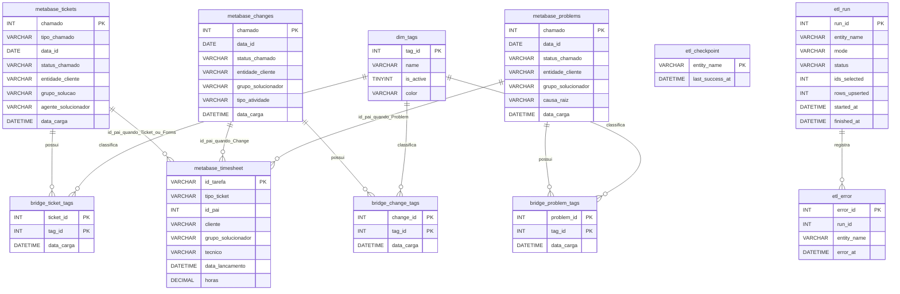

# DER Simplificado do DW / Metabase

Este DER foi pensado para **apresentação** e entendimento rápido do modelo lógico usado pelo Metabase.

## Visão simplificada

## Leitura do modelo

### Tabelas fato
- `metabase_tickets`: incidentes e requisições
- `metabase_changes`: mudanças
- `metabase_problems`: problemas
- `metabase_timesheet`: horas consolidadas

### Dimensão e pontes
- `dim_tags`: catálogo de etiquetas
- `bridge_ticket_tags`, `bridge_change_tags`, `bridge_problem_tags`: relacionamento N:N entre entidades e tags

### Tabelas operacionais do ETL
- `etl_checkpoint`: controla a última execução válida por entidade
- `etl_run`: log de execução
- `etl_error`: log de falhas

## Regras importantes para apresentação

- O modelo usa **relacionamentos lógicos**; não há `FOREIGN KEY` física no banco.
- `metabase_timesheet.id_pai` aponta para tabelas diferentes conforme `tipo_ticket`:
  - `Ticket` e `Forms` → `metabase_tickets.chamado`
  - `Change` → `metabase_changes.chamado`
  - `Problem` → `metabase_problems.chamado`
- Tags podem ser consumidas de duas formas:
  - por texto nas colunas `tags` das tabelas fato
  - por modelagem relacional via `dim_tags` + tabelas bridge

## Sugestão de uso

- Para documentação técnica detalhada: `docs/DATABASE_METABASE.md`
- Para colar no Excel: `docs/DICIONARIO_TECNICO_METABASE.tsv`
